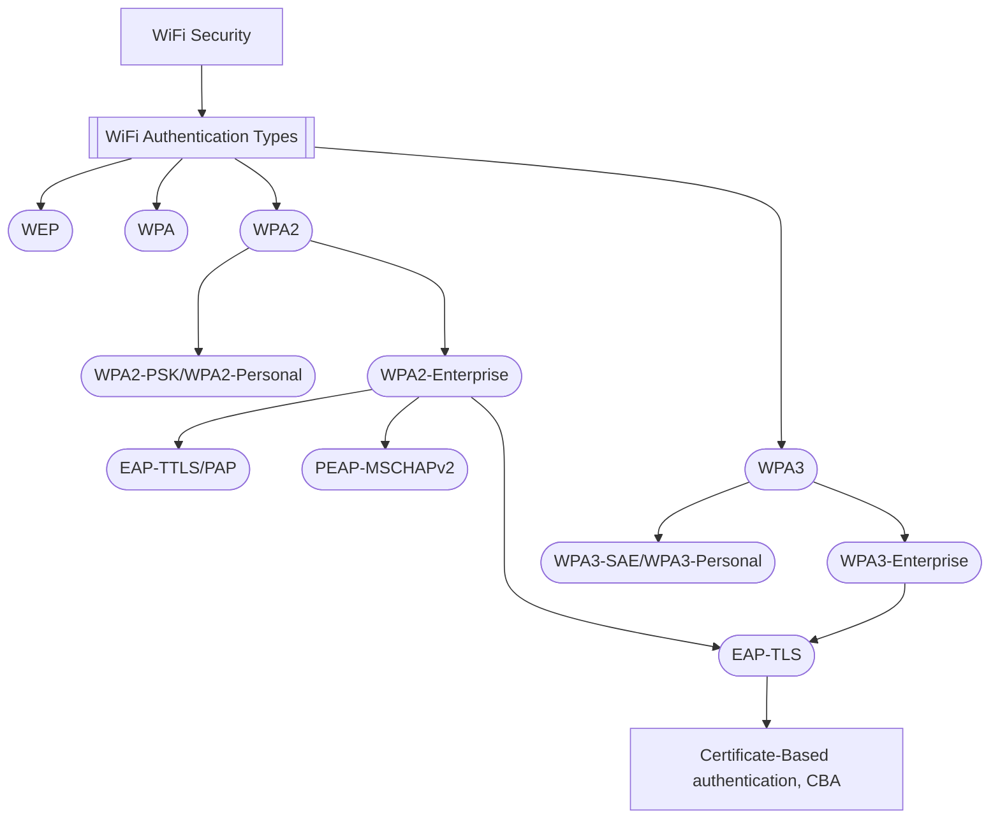
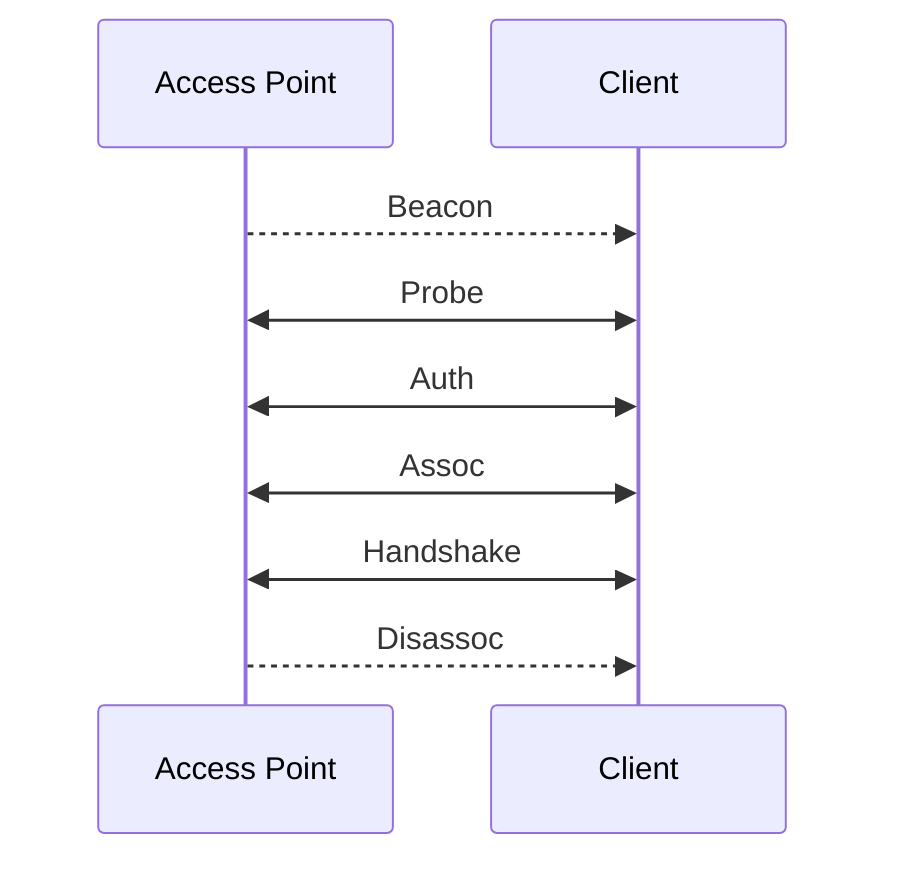

# Wi-Fi Pen-testing Basics Module

## Introduction

Wi-Fi penetration testing is a critical process employed by cybersecurity professionals to assess the security posture of Wi-Fi networks. The aim of Wi-Fi pentesters is to uncover potential weaknesses and vulnerabilities that could compromise network security.

### Wi-Fi Authentication Types

We need to understand Wi-Fi authentication to have any hope of being able to conduct red (or blue) team work around wifi networks.

- WEP (Wired Equivalent Privacy): Original Wifi security protocol, providing basic encryption. Now considered insecure.

- WPA (Wifi Protected Access): Introduced as an interim improvement to WEP, WPA offers better encryption through TKIP (temporal key integrity protocol) but is still considered outdated.

- WPA2: A significant advancement over WPA, now using AES for security. Considered the standard for many years.

- WPA3: The latest standard with enhanced encryption and more robust password authentication

Wifi penetration testers need to be comfortable with the 4 key components of a test:

- Assessing passphrases

- Analysing configurations

- Probing infrastructure

- Testing client devices

## 802.11 Frames

### Frames

IEEE 802.11 is the standard which is commonly known as Wi-Fi. All 802.11 frames use the MAC frame which  acts as a foundation for all fields and actions performed between the client and access point. There are 9 fields in the MAC data frame:

- **Frame Control**: Information such as type, subtype, protocol version, to DS, from DS, Order, etc...

- **Duration/ID**: The amount of time in which the wireless medium is occupied.

- **Address 1, 2, 3 and 4**: The MAC addresses involved in the communication, but can also mean different things depending on the origin. These tend to include the BSSID of the access point and the client MAC address.

- **SC**: Sequence control, prevents duplicate frames.

- **Data**: What is transmitted.

- **CRC**: The cyclic redundancy check is essentially a checksum.

IEEE frames can be placed in different categories based on the actions they are involved in. Generally speaking these are the following:

- **Management (00)**: Used for management and control.

  - *Beacon Frames (1000)*: Communicate presence of an access point to the client or station. Includes information such as supported encryption, authentication, SSID and data rates.

  - *Probe Requests (0100) and Probe Responses (0101)*: Allow clients to discover nearby access points and get information about specific access points.

  - *Authentication Request and Response (1011)*: Identifies the client to the access point and begins connection.

  - *Association/Reassociation Request and Response (0000, 0001, 0010, 0011)*: After authentication to see if the client is able to connect.

  - *Disassociation/Deauthentication (1010, 1100)*: Sent from access point to client to terminate connections. Usually contain a reason code to indicate why the disconnection is happening. We will often craft these packets during wifi pentests.

- **Control (01)**: Used for managing transmission and reception of data frames. Essentially quality control.

- **Data (10)**: Contain data for transmission.

Typically management frames are what we are going to target in pentesting, since they control connections between access points and clients.

### Connection Cycle

The typical connection process between clients and access points is known as the connection cycle. The process may vary slightly depending on what standard is being used but the general cycle is as follows:

1. Beacon

2. Probe request and response

3. Authentication request and response

4. Association request and response

5. Handshake or other security mechanism

6. Disassociation/Deauthentication

### Authentication Methods

There are two primary authentication systems commonly used in wifi networks: Open system and shared key. Open systems do not require a shared secret or credentials  for access. Shared key requires that both the client and access point verify each others identities. Open systems are convenient for public or guest networks. Shared key systems provide a higher level of security by restricting access:

|                       | WEP            | WPA           | 802.11i/WPA2  |
| --------------------- | -------------- | ------------- | ------------- |
| **Auth method**       | Pre-shared key | PSK or 802.1x | PSK or 802.1x |
| **Encryption**        | RC4            | TKIP          | AES           |
| **Message Integrity** | CRC-32         | MIC           | CCMP          |
| **Security**          | Weak           | Strong        | Stronger      |

WEP authentication just involves a challenge and a response, whereas WPA uses a 4-way handshake. On a higher level this looks like:

1. Auth request.

2. Auth response.

3. Pairwise key generate: Client and AP calculate PMK from the PSK or password.

4. Four-way handshake: Steps to verify that both the client and AP actually know the password.

WPA3 is also a thing and replaces the PSK with a feature called Simultaneous Authentication of Equals (SAE). WPA3 is considered more secure that WPA2 but has had a much slower adoption due to hardware restrictions.

## Wi-Fi Interfaces

Interfaces are a cornerstone of wifi pentesting since machines transmit and receive data through them.

