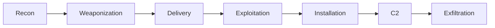

# The Threat Landscape

### Threat Actors

Threat actors try to steal, sabotage, or stop people from using computer systems or accessing information that you are authorised to use. Threat actors are classified by their character, motives and TTPs. 

**Explorer**: Potentially the least nefarious, doing it for the love of the game. No intent for real harm. For example via XSS or phishing.

**Hacktivist**: Motivated by an external cause or ideology. Mainly target political or organisations as targets. A strategy used by Hacktivists could be DDoS attacks via a botnet.

**Cyberterrorist**: Target critical infrastructure in a society. These can be state-backed or rogue. Generally more sophisticated than a Hacktivist. Potentially use spear-phishing.

**Cybercriminal**: Generally target individuals or organisations for financial gain. This could be done through ransomware campaigns.

**Cyberwarrior**: Motivated by national interests and are backed by a nation-state. They use targeted cyber weapons and this can include zero-days.

There are also different categories of hackers:

**White Hat**: Ethical hacker who operates with authentication.

**Black Hat**: Attacks for profit or to cause harm.

**Grey Hat**: Attacks without permission but does not have malicious intent.

**Blue Hat**: Term used for external companies and auditors that perform security assessments.

### Threats

A threat is an action exploiting a vulnerability resulting in harm to a network or computer system. An attack vector is the path that is used by a threat actor to exploit the vulnerability. The method is how the vulnerability is exploited.

For example in a phishing campaign which installs malware locally: The vulnerability is the user, the method is the email message, and the attack vector is the email attachment.

An attack path is the chain of attack vectors used in an incident. Cybersecurity threats can be generally divided into 4 categories:

- **Social engineering**: Tricking a person into performing an action that is not in their best interests.

- **Malware**: Software designed to disrupt user access to a computer system, steal information or stage future attacks.

- **Unauthorised access**: User accesses assets they shouldn't be able to, either digitally or physically.

- **System design failure**: Security flaws in a system or application.

### Threat Intelligence

Threat intelligence is evidence-based knowledge about an existing or emerging hazard to assets. There are 3 requirements to threat intelligence:

- *Relevance*: The information must be relevant to your organisation.

- *Actionability*: The information must be able to detail how you can respond to the threat.

- *Context*: There must be enough information to correctly assess the threat.

Threat intelligence can come from many sources, both internal and external. You can have previous vulnerability assessment results or incident reports that might constitute threat intelligence. You can also get threat intelligence from external sources such as government sites.

The CVSS is a free, open industry standard for assessing computer vulnerabilities for severity. MITRE ATT&CK is a knowledge base of adversary tactics and techniques. Sometimes companies from the same industry will share threat intelligence with each other.

There are recognised standards for describing cyber threats. These include *STIX* and *TAXI*. STIX is a collaborative and structured way of describing threat information. STIX also recommends actions to mitigate actions. TAXI is a protocol for communication threat information over networks - This facilitates the sharing of CTI.

### Attack Frameworks

Attack frameworks help us classify and analyse the different stages of an attack and help us develop strategies for containment and response. Attack frameworks are primarily motivated by APTs to help combat more complex attacks. Two cyber attack frameworks are the *Cyber kill chain* and *MITRE ATT&CK*.

#### Cyber Kill Chain

The cyber kill chain describes the various stages of a cyber attack.

- **Recon**: Attacker gathers information about the target and its systems

- **Weaponization**: The attacker creates an exploit for the target.

- **Delivery**: The attacker distributes the exploit to the target.

- **Exploit**: The attacker uses the payload to gain initial access to the targets system.

- **Installation**: The attacker gains a foothold into the system and maintains access via persistence.

- **C2**: The attacker establishes communication with the compromised systems.

- **Exfiltration**: The attacker extracts assets that were the goal of the attack.

#### MITRE ATT&CK

Helps defenders understand the attackers methodologies. MITRE ATT&CK also provides knowledge for describing and mitigating attacks. It is comprised of a matrix detailing TTPs of adversaries. The matrix can help organisations find and fix the most critical vulnerabilities for their assets.

### Outbreak Alerts and Advisories

Outbreaks can compound damage and loss over time, so CTI should be kept up to date and incidents should be acted on quickly. Predictive analytics can be used which relies on looking at previous incidents globally and emerging trends.

Often frameworks for outbreak alerts will include:

- NIST CSF

- Cyber Kill Chain

- NIST IR

- MITRE ATT&CK

