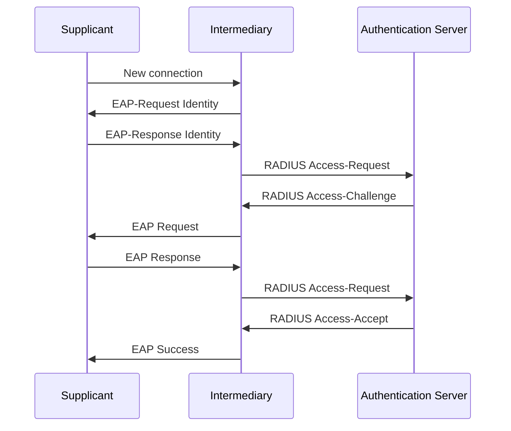

# Authentication and Access Control

Authentication comes in two parts: Identification and verification. The user must say who they are and then prove it.

### Authentication Methods

The most common ways to prove who you are include:

- **Something you know**: Passwords, Q&A, PIN.

- **Something you have**: Includes cards, keys, devices, hardware or software tokens (time-based or event-based).

- **Something you are**: Biometrics.

- **Contextual**: *Somewhere you are, something you do*. Active biometrics such as mouse usage, voice, or typing characteristics.

Multi-factor authentication combines 2 or more types of the above.

### SSO

Implementing network authentication mechanisms can be difficult. If you make security too complex, then users are going to take risks and shortcuts which will actually weaken your posture. SSO lets a user sign in once and then access multiple systems. This is achieved by passing authentication tokens. Equally, there is same sign-on that allows users to connect to multiple services using one set of credentials.

Often the user attempts to connect to the service provider (SP) who fetches authentication tokens from the identity provider (IdP) that the user has logged in with prior. SSO can remove the burden of having to remember multiple credentials.

SSO also facilitates compliance and user reporting. A disadvantage though is that if user credentials are compromised it can allow an attacker to access many more services than otherwise.

1. A user connects to an SP

2. The SP redirects the user to the IdP login

3. The user authenticates to the IdP

4. The IdP sends the SP an authentication token that contains information about the login.

5. The SP allows the user to access the service

SSO requires a protocol for implementation. Two common protocols are OAuth and SAML (Security assertion markup language).

### Authentication Framework, Protocols, and Tools

An authentication framework is the basic schema for how entities will prove their identities. One commonly used protocol is RADIUS (Remote authentication dial-in user service). This is a AAA protocol that can also implement the 802.1X framework.

A RADIUS server can store credentials in a RADIUS database or external servers. It is common for RADIUS to use an LDAP compliant server for credential storing. LDAP is an open industry-standard application protocol for accessing directory services over an IP network.

Similar to RADIUS, TACACS+ is a remote AAA protocol. TACACS+ encrypts all protocols and relies on TCP whereas RADIUS only encrypts passwords and relies on UDP.

Authentication methods define the manner in which authentication takes place. For example the Password authentication protocol (PAP) can authenticate PPP sessions. PAP uses a two-way handshake. CHAP also authenticates PPP sessions but it uses a three-way handshake with a random string and hash which makes it more resilient to attack.

The 802.1X framework is an IEEE standard for port-based network access control. 802.1X requires a supplicant, an intermediary and an authentication server. The supplicant is the client device, the intermediary is a network device that links the client to the network. The authentication server is a trusted server that can adjudicate the authentication process. The AS typically supports RADIUS configurations.

The extensible authentication protocol (EAP) framework. It provides some common functions and negotiation of authentication methods.

- **EAP-FAST**: Uses a protected access credential (PAC).

- **PEAP**: Encapsulates EAP messages within a TLS tunnel.

- **LEAP**: Primarily used in CISCO LANs. Encrypts data using WEP keys.

### Access Control

Access control is the ability to restrict access to a specific physical location or asset. Access control methods determine what systems a user is allowed access to.

**Mandatory Access Control** (MAC) does not allow any actor to change the security requirements.

**Discretionary Access Control** (DAC) allows some flexibility in who defines access. The subject can adjust permissions.

**Lattice-based access control** (LBAC) assigns access to assets by way of a pyramid. Everyone has access to all materials at or below their level.

**Rule-set-based access control** (RSBAC) assigns access based on a list of rules, and the program will go through them one by one for matches.

**Role-based access control** (RBAC) assigns access based on a set of permissions that is provided to a user based on their role.

**Attribute-based access control** (ABAC) assigns access based on dynamic factors. This makes it the most complex but also the most flexible.

 Shifting from a user perspective to a group or role based control method can rapidly speed up policy creation and minimise risk of incorrectly setting privileges.

### Network Access Control

NAC is an appliance or virtual machine controlling access to a network. It can evaluate and classify security compliance by user, device, location or operating system. Often a NAC has centralised architecture.

NAC began as a network authentication and authorisation method for devices joining the network, which followed IEEE 802.1X standards.

A captive portal is a webpage that may require you to sign or agree to terms before granting access to the network.

NAC has some challenges in the modern day, including the increase in guest accounts, BYOD networks and IoT devices. All of these expand the attack surface.

IoT devices are a massive threat risk for networks. They often only have enough authentication capabilities to use a key set at creation. NAC can help provide some visibility into these devices.

For example, NAC can allow an IP camera to connect to its storage server but deny it to a finance server. This segments the network by device function.
